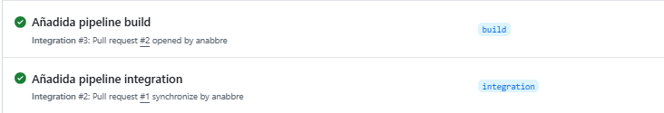
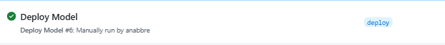
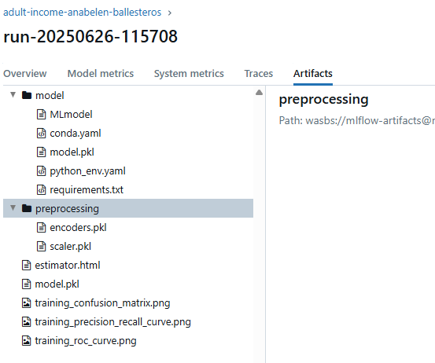
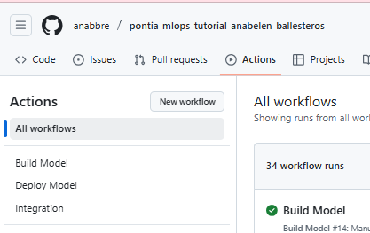
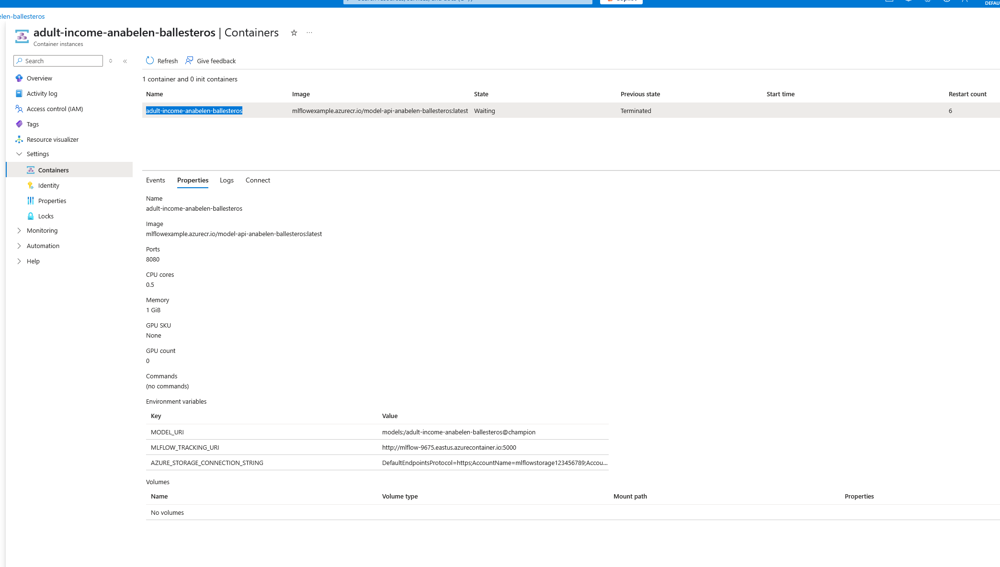
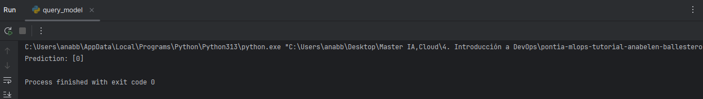
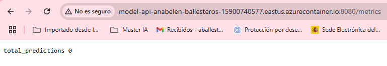

# 🤖 Simple ML Training Project

## 📌 Descripción

Repositorio de práctica para el módulo de DevOps (Máster IA, Cloud Computing y DevOps), siguiendo el tutorial de PontIA. El objetivo es implementar un flujo MLOps realista usando **GitHub Actions**, **MLflow** y buenas prácticas de control de versiones: integración continua, ramas, PRs, variables/secretos, ejecución automática de pipelines y registro de modelos.

---

## 📁 Estructura del proyecto

```
├── .github/
│ └── workflows/
│ ├── integration.yml # Pipeline de integración continua 
│ ├── build.yml # Pipeline de entrenamiento y registro del modelo
│ ├── deploy.yml # Pipeline de despliegue en Azure Container Instances
│
├── data/
│ └── raw/ # Datos sin procesar
│ └── .gitkeep
│
├── deployment/
│ └── app/
│ ├── Dockerfile # Imagen para el despliegue de la API
│ └── requirements.txt # Dependencias de la API
│
├── mlartifacts/ # Artefactos generados en el flujo (modelo, registros...)
├── mlruns/ # Directorio de MLflow para seguimiento de experimentos
│
├── model_tests/
│ └── test_model.py # Tests automáticos para el modelo
│
├── models/ # Modelos exportados
│ └── .gitkeep
│
├── scripts/
│ ├── query_model.py # Script para consultar el modelo vía API
│ └── register_model.py # Script para registrar el modelo en MLflow
│
├── src/
│ ├── init.py
│ ├── data_loader.py # Carga y preprocesamiento de datos
│ ├── evaluate.py # Evaluación del modelo
│ ├── main.py # Entrenamiento y guardado del modelo
│ ├── model.py # Definición del modelo
│ ├── run_id.txt # ID del último experimento exitoso
│ └── training.log # Logs de entrenamiento
│
├── unit_tests/
│ ├── init.py
│ ├── test_data_loader.py # Test para la carga de datos
│ ├── test_evaluate.py # Test de evaluación del modelo
│ └── test_model.py # Test unitario del modelo
│
├── README.md
├── requirements.txt # Dependencias generales del proyecto
└── .gitignore
```

### 🗂️ Descripción de carpetas

- **.github/workflows/**: Contiene los tres workflows de CI/CD (`build.yml`, `integration.yml`, `deploy.yml`).
- **data/raw/**: Datos originales del dataset.
- **deployment/app/**: Código necesario para desplegar la API en Azure Container Instances.
- **mlartifacts/** y **mlruns/**: Directorios para el seguimiento y almacenamiento de modelos y métricas por MLflow.
- **model_tests/**: Script para validar el modelo después del entrenamiento.
- **models/**: Carpeta vacía reservada para versiones del modelo exportadas.
- **scripts/**: Scripts complementarios para registrar y consultar el modelo vía API.
- **src/**: Código principal del pipeline de entrenamiento, evaluación y definición del modelo.
- **unit_tests/**: Tests unitarios para comprobar la funcionalidad de los distintos módulos (`data_loader`, `evaluate`, `model`).
- **requirements.txt**: Fichero con todas las dependencias necesarias para instalar y ejecutar el proyecto.

---

## 🔧 Preparación del Repositorio

1. Crear nuevo repositorio con el nombre `pontia-mlops-tutorial-nombre-apellido`.
2. Clonar el repo original de referencia: `https://github.com/merlinkd/pontia-mlops-tutorial`.
3. Copiar el contenido del repositorio base al nuevo repositorio personal.
4. Añadir `.gitignore`, `requirements.txt`, y actualizar estructura de carpetas.
5. Crear el archivo `requirements.txt` en la raíz del proyecto con las dependencias básicas del modelo:
- scikit-learn
- pandas
- joblib
- mlflow
6. Configurar los **Secrets** y **Variables** en GitHub > Settings > Secrets and variables > Actions:
   - Secret: `AZURE_STORAGE_CONNECTION_STRING`
   - Variables: `MLFLOW_URL`, `EXPERIMENT_NAME`, `MODEL_NAME`
7. Ejecutar `main.py` localmente y verificar la creación de registros en `mlruns/`.
8. Subir los cambios a GitHub (`push` a la rama `main` o a la rama correspondiente).


## 🔁 Flujo de trabajo seguido CI/CD

### 📌 1. **Pipeline de Integración Continua**: `integration.yml`

Esta pipeline verifica que el repositorio esté correctamente estructurado antes de integrar cambios a `main`.

📁 El archivo `.github/workflows/integration.yml` incluye:

- `workflow_dispatch`: permite ejecutar la pipeline manualmente desde GitHub Actions.
- Versión de Python actualizada a 3.10.
- Instalación de dependencias desde `requirements.txt`.
- Se ejecuta automáticamente en **push** o **pull request** hacia la rama `integration`.
- Realiza validaciones básicas:
  - Que exista el archivo `main.py`.
  - Que se puedan instalar correctamente las dependencias.
- Se añadió `continue-on-error: true` e `if: always` para que la pipeline continúe incluso si fallan los tests.
- Requiere PR para merge a `main` con revisión de compañero/a (`Looks good to me`).

💡 **Consejo**: Esta pipeline es clave porque **bloquea los merges directos** a `main` si algo falla. Obliga a trabajar con ramas y revisiones, promoviendo buenas prácticas en integración continua.

> 📝 **Nota:** Inicialmente también se había subido la pipeline `deploy.yml`, pero fue eliminada temporalmente por errores de ejecución. Se re-subirá más adelante otra versión una vez solucionados los conflictos.

---

### 🔐 Configuración de GitHub: Rulesets, Secrets y Variables

Para asegurar un correcto funcionamiento del flujo CI/CD y proteger la rama principal, se configuró el repositorio en GitHub con los siguientes pasos:

#### 🛡️ Ruleset para la rama `main`

Se añadió un conjunto de reglas (ruleset) en GitHub para proteger la rama `main`, incluyendo:

1. **Target**: `main`.
2. **Restricciones aplicadas**:
   - ❌ No permitir eliminaciones de la rama.
   - 🔒 Bloquear `force push`.
   - ✅ Requerir que los **checks de estado pasen** antes de permitir merge.
   - 🔄 Exigir que las ramas estén actualizadas con respecto a `main` antes de hacer merge.
   - ✔️ Especificar qué check de estado se requiere (por ejemplo, el job de la pipeline `integration.yml`).

> 📝 Esto asegura que no se puedan hacer merges si la pipeline de integración no pasa correctamente.

---

#### 🔑 Creación de Secrets y Variables del Repositorio

Se configuraron los siguientes secretos y variables desde **Settings > Secrets and variables > Actions**:

##### 🔐 Secret:

- `AZURE_STORAGE_CONNECTION_STRING`: Contiene el string de conexión necesario para almacenar modelos en Azure Blob Storage.

##### ⚙️ Variables:

- `EXPERIMENT_NAME`: Nombre del experimento en MLflow (ej. `nombre-apellido-income`).
- `MODEL_NAME`: Nombre del modelo en MLflow.
- `MLFLOW_URL`: URL del servidor de MLflow (ej. `http://mlflow-servidor:5000`).

---

#### 🔄 Verificación de configuración

Para validar que la configuración funciona correctamente:

1. Se creó un **pull request (PR)** desde la rama `integration` hacia `main`, con un cambio trivial.
2. El ruleset bloqueó el merge automáticamente porque no se cumplían los checks requeridos.
3. Se validó que la **pipeline `integration.yml`** se ejecutaba correctamente como verificación del estado del repositorio.

> 💡 **Consejo:** Esta configuración es clave para garantizar un flujo de trabajo profesional, donde solo se permiten cambios en `main` tras validaciones y revisiones.

---

### 2. 🏗️ **Pipeline de Construcción del Modelo**: `build.yml`

Esta pipeline permite entrenar y registrar el modelo automáticamente en MLflow usando GitHub Actions.

🔧 El archivo `.github/workflows/build.yml` incluye:

- `workflow_dispatch`: permite ejecutar la pipeline manualmente desde GitHub Actions.
- También se ejecuta automáticamente al hacer **`push`** sobre la rama `main`.
- Versión de Python configurada a 3.10.
- Instalación de dependencias desde `requirements.txt`.
- Descarga del dataset desde la UCI.
- Entrenamiento del modelo mediante ejecución de `main.py`.
- Obtención y exportación del `run_id` generado en el entrenamiento para poder registrar el modelo.
- Registro del modelo en MLflow mediante el script `register_model.py`.
- Se agregaron variables de entorno con los valores necesarios obtenidos desde los **Secrets** y **Repository Variables**.

📄 El archivo `register_model.py` fue modificado para que tome los valores desde el entorno:

```python
run_id = os.getenv('RUN_ID', 'run_id not found')
model_name = os.getenv("MODEL_NAME", "no_name")
```

🧪 Se añadió un paso de testeo básico para validar el modelo entrenado:

```yaml
- name: Run model tests
  run: python model_tests/test_model.pyv
```

📁 Estos tests se ubican dentro de la carpeta `model_tests/` e incluyen validaciones como:

- Que el modelo se cargue correctamente.
- Que las predicciones tengan forma esperada.
- Que las predicciones estén en el rango esperado.
- Que la precisión (accuracy) supere el umbral mínimo (ej. 0.80).

---
### 🔧 3. **Pipeline de Despliegue de Modelo**: `deploy.yml`

Esta pipeline permite desplegar automáticamente el modelo entrenado en un contenedor de Azure, incluyendo la configuración necesaria y el registro del modelo con sus artefactos de preprocesado.

📁 El archivo `.github/workflows/deploy.yml` realiza los siguientes pasos:

- Define un `workflow_dispatch` para permitir la ejecución manual desde GitHub Actions.
- Usa como base el fichero `deploy.yml` actualizado proporcionado por el profesorado, con errores anteriores corregidos.
- Configura el entorno con variables y secretos previamente definidos:
  - `AZURE_CREDENTIALS`, `ACR_USERNAME`, `ACR_PASSWORD`, `ACR_NAME`, `AZURE_RESOURCE_GROUP`
  - `MODEL_NAME`, `MODEL_ALIAS`, `AZURE_CONTAINER_NAME`, `IMAGE_NAME`, `AZURE_REGION`
- Utiliza los valores de entorno definidos para desplegar el contenedor con la API del modelo.
- El modelo se registra en MLflow junto a los artefactos de preprocesamiento:
  - `scaler.pkl` y `encoders.pkl` se loguean mediante `mlflow.log_artifact`.

✅ Antes de lanzar esta pipeline, se corrigieron:

- El `Dockerfile`, incluyendo los comandos para instalar las dependencias:

```
COPY requirements.txt /code/
RUN pip install --upgrade pip
RUN pip install --no-cache-dir -r requirements.txt
```

- El archivo `register_model.py`, cambiando `{model_artifact_path}` por `model` para evitar errores de URI en el registro.
- Se incluyó `query_model.py` entregado por el profesor.

🧪 Al ejecutar la pipeline desde el branch `deploy`, se valida que:

- El contenedor con el modelo se lanza correctamente.
- El modelo queda registrado junto a los artefactos (modelo, scaler, encoders).
- La ejecución se ve reflejada correctamente en MLflow.

📝 Finalmente:

- Se ejecuta manualmente la pipeline "Deploy Model" desde el branch `deploy`.
- Se revisan los logs si es necesario con:

```bash
az container logs --resource-group mlflow-rg --name model-api-NOMBRE
```

- Se solicita revisión a un/a compañero/a, quien debe dejar un comentario como "Looks good to me" antes de hacer merge a `main`.

---

## 📎 Anexo

Este proyecto ha seguido buenas prácticas DevOps ✅:

- 🧩 Uso de ramas `integration`, `build`, `deploy`.

- 🔁 Validación por pipelines antes del merge.




- 📦 Registro de modelos y artefactos en MLflow.



- 🤖 Automatización mediante GitHub Actions.m



- 🚀 Despliegue automático a Azure.



📬 **Evidencia del funcionamiento**: API disponible + predicciones consultables con script local (`query_model.py`).




---

## 📄 Archivo adicional: problemas_resueltos.md

Se incluye el archivo `problemas_resueltos.md` con un resumen de los problemas encontrados durante la implementación y cómo se resolvieron. 

---

## 👥 Autora del proyecto

- **Nombre y Apellido**: Ana Belén Ballesteros  
  - Máster en IA, Cloud Computing y DevOps
